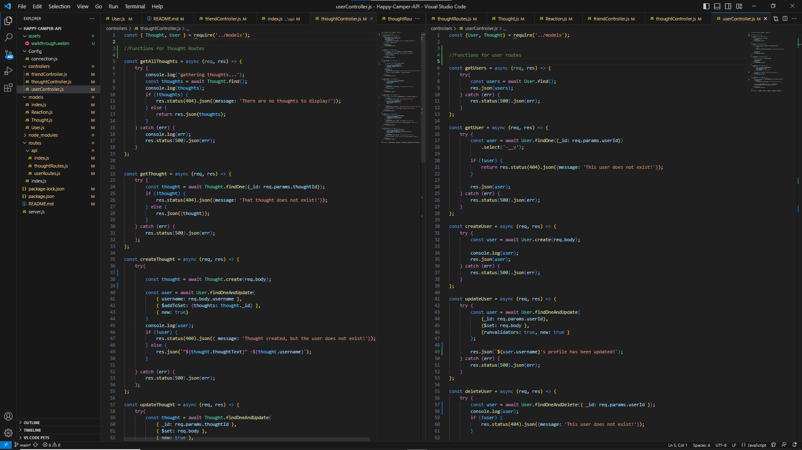

# Happy-Camper-API

## Technologies Used
| Javascript || (https://developer.mozilla.org/en-US/docs/Web/JavaScript) |
| MongoDB    || (https://www.mongodb.com/)                                |
| Mongoose   || https://mongoosejs.com/                                   |
| Express    || (https://expressjs.com/)                                  |
| Insomnia   || (https://docs.insomnia.rest/)                             |    

## Description

A server-side application that utilizes Mongoose, express, and MongoDB to provide the user with the ability to create user profiles, view user profiles, update user profiles, delete user profiles, add Friends to user profiles, delete freinds from user profiles, create thoughts as a user, delete thoughts as a user, make edits to thoughts as a user, react to thoughts as a user, and delete reactions from thoughts. 

 OR (https://drive.google.com/file/d/178bLwdrl74Wai2S7Pw9Ns_mT1F3tHyLv/view)

## User Story

AS A social media startup
I WANT an API for my social network that uses a NoSQL database
SO THAT my website can handle large amounts of unstructured data

## Acceptance Criteria

GIVEN a social network API
WHEN I enter the command to invoke the application
THEN my server is started and the Mongoose models are synced to the MongoDB database
WHEN I open API GET routes in Insomnia for users and thoughts
THEN the data for each of these routes is displayed in a formatted JSON
WHEN I test API POST, PUT, and DELETE routes in Insomnia
THEN I am able to successfully create, update, and delete users and thoughts in my database
WHEN I test API POST and DELETE routes in Insomnia
THEN I am able to successfully create and delete reactions to thoughts and add and remove friends to a user’s friend list

## Installation

1. clone Repository
2. Navigate to Root Directory
3. Run npm install

## Usage

1. Complete Installation
2. Run: npm run start
3. Open insomnia
4. Test routes

## Learning Points

The purpose of this challenge was to practice working with mongoose and MongoDB. More specifically, it was an opportunity to define schemas, to define models using schemas, and to manipulate data within those models using an express router. 

## Credits

* [LinkedIn](https://linkedin.com/in/justinchoica)
* [Github](https://github.com/justinschoi93)
* [Email](justinschoi93@gmail.com)
